  <picture><source media="(max-width: 600px)" srcset="./assets/intro-mobile.svg" /></picture>
  <picture><source media="(max-width: 600px)" srcset="./assets/building-mobile.svg" /></picture>
  <picture><source media="(max-width: 600px)" srcset="./assets/tech-mobile.svg" /></picture>
  <picture><source media="(max-width: 600px)" srcset="./assets/languages-mobile.svg" /></picture>
  <picture><source media="(max-width: 600px)" srcset="./assets/footer-mobile.svg" /></picture>

